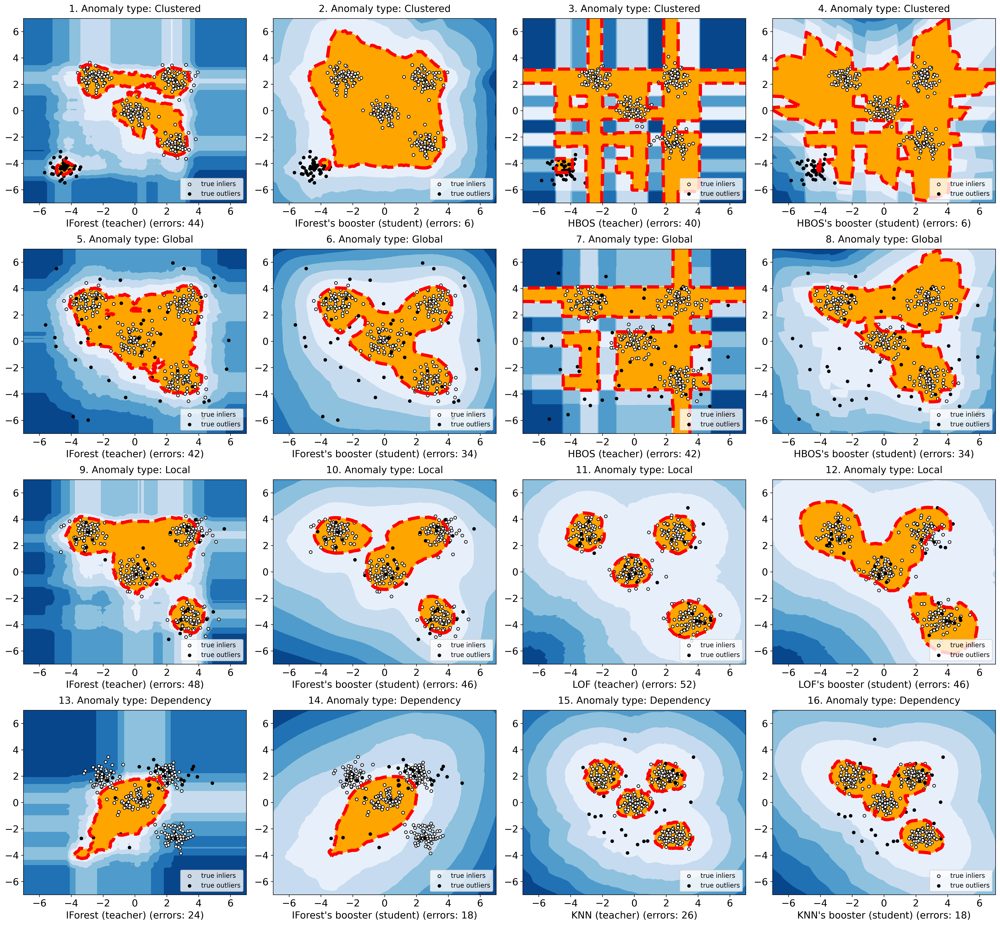

Official code and data repository of [**UADB**: Unsupervised Anomaly Detection Booster].
__Please star, watch, and fork UADB for the active updates!__

## What is UADB?
UADB is a booster for unsupervised anomaly detection (UAD) on tabular tasks.
Note that UADB is not a universal winner on all taular tasks, however, it is a model-agnostic framework that can generally enhance any UAD on all types of tabular datasets in a unified way.

## How to train?
Prepare (create Results first)
* ```mkdir Results```

Select tabular data and source UAD needed to be enhanced
* modify config.py

Run UADB
* ```python main.py```

## Mainstream Unsupervised Anomaly Detection Models.
Isolation Forest (IForest) [paper](https://cs.nju.edu.cn/zhouzh/zhouzh.files/publication/icdm08b.pdf?q=isolation-forest) that isolates observations by randomly selecting a feature and a splitting point;

Histogram-based outlier detection (HBOS) [paper](https://www.goldiges.de/publications/HBOS-KI-2012.pdf) assumes the feature independence and calculates the degree of outlyingness by building histograms; 

Local Outlier Factor (LOF) [paper](https://dl.acm.org/doi/pdf/10.1145/342009.335388) measures the local deviation of the density of a sample with respect to its neighbors;

K-Nearest Neighbors (KNN) [paper](https://dl.acm.org/doi/pdf/10.1145/342009.335437) views an instance's distance to its kth nearest neighbor as the outlying score;

Principal Component Analysis (PCA) [paper](https://apps.dtic.mil/sti/pdfs/ADA465712.pdf) is a linear dimensionality reduction using Singular Value Decomposition of the data to project it to a lower dimensional space. In anomaly detection, it projects the data to the lower dimensional space and then reconstruct it, thus the reconstruction errors are viewed as the anomaly scores;

One-class SVM (OCSVM) [paper](https://proceedings.neurips.cc/paper/1999/file/8725fb777f25776ffa9076e44fcfd776-Paper.pdf) maximizes the margin between the abnormal and the normal samples, and uses the hyperplane that determines the margin for decision;

Clustering Based Local Outlier Factor (CBLOF) [paper](http://www.diag.uniroma1.it/~sassano/STAGE/Outliers.pdf) classifies the samples into small clusters and large clusters  and then using the distance among clusters as anomaly scores;

Connectivity-Based Outlier Factor (COF) [paper](https://link.springer.com/chapter/10.1007/3-540-47887-6_53) uses the ratio of average chaining distance of data point and the average of average chaining distance of k nearest neighbor of the data point, as the outlier score for observations;

Subspace Outlier Detection (SOD) [paper](https://www.dbs.ifi.lmu.de/~zimek/publications/PAKDD2009/pakdd09-SOD.pdf) detects outlier in varying subspaces of a high dimensional feature space;

Empirical-Cumulative-distribution-based Outlier Detection (ECOD) [paper](https://arxiv.org/pdf/2201.00382.pdf) is a parameter-free, highly interpretable outlier detection algorithm based on empirical CDF functions;

Gaussian Mixture Models (GMM) [paper](http://www.leap.ee.iisc.ac.in/sriram/teaching/MLSP_19/refs/GMM_Tutorial_Reynolds.pdf) fit k Gaussians to the data. Then for each data point, calculate the probabilities of belonging to each of the clusters, where the lower probabilities indicate higher anomaly scores;

Lightweight on-line detector of anomalies (LODA) [paper](https://link.springer.com/article/10.1007/s10994-015-5521-0) is an ensemble detector and is particularly useful in domains where a large number of samples need to be processed in real-time or in domains where the data stream is subject to concept drift and the detector needs to be updated online;

Copula Based Outlier Detector (COPOD) [paper](https://arxiv.org/pdf/2009.09463.pdf) is a parameter-free, highly interpretable outlier detection algorithm based on empirical copula models;

Deep Support Vector Data Description (DeepSVDD) [paper](http://proceedings.mlr.press/v80/ruff18a/ruff18a.pdf) trains a neural network while minimizing the volume of a hypersphere that encloses the network representations of the data, the distance of the transformed embedding to the hypersphere's center is used to calculate the anomaly score.

For all source UAD models, we use their default parameters in their original papers (which have been fine-tuned to achieve the best performance).
Please refer to [PyOD](https://pyod.readthedocs.io/en/latest/pyod.models.html) for more information.

## Surprising effects on source UAD's decision boundaries.



